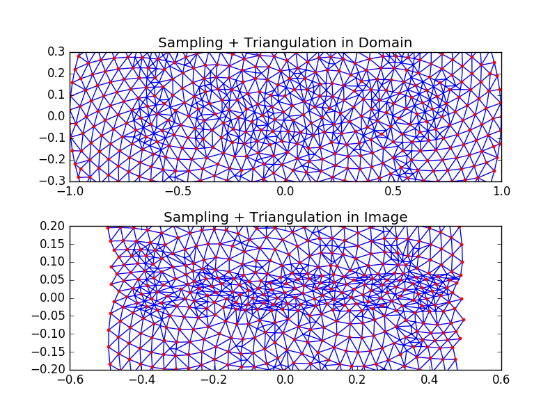
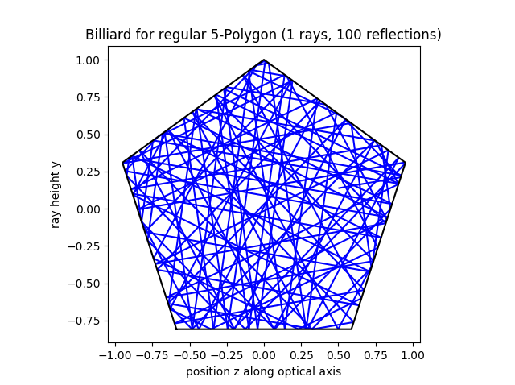
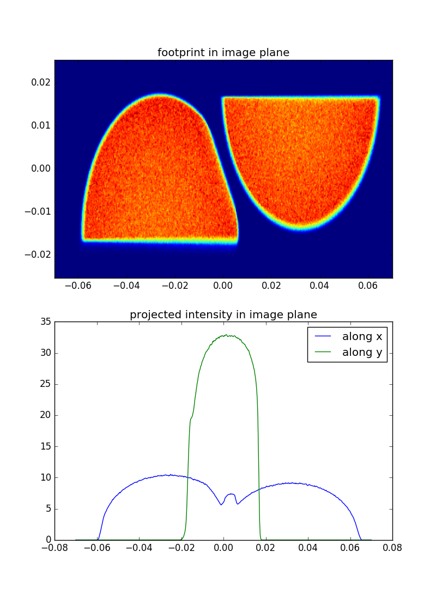
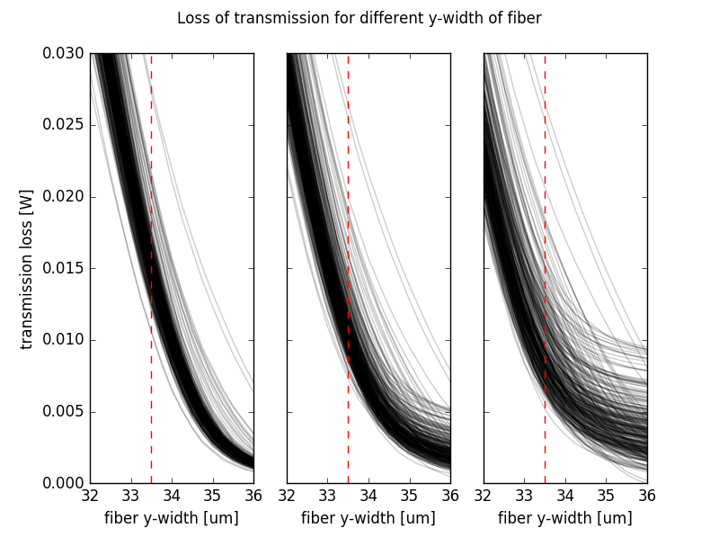

# Tados
Tools for the Analysis and Design of Optical Systems 

## Features

* advanced interaction between Python and FRED / Zemax
* adaptive pupil sampling
* fast computation of intensity maps (footprint plots) using triangulation
* advanced tolerancing via Python script
* interface for external optimization
* minimal 2D sequential raytracer for freeform surfaces

## Dependencies

* numpy, matplotlib
* [pyzdde](https://github.com/indranilsinharoy/PyZDDE)

## Examples

  
 
